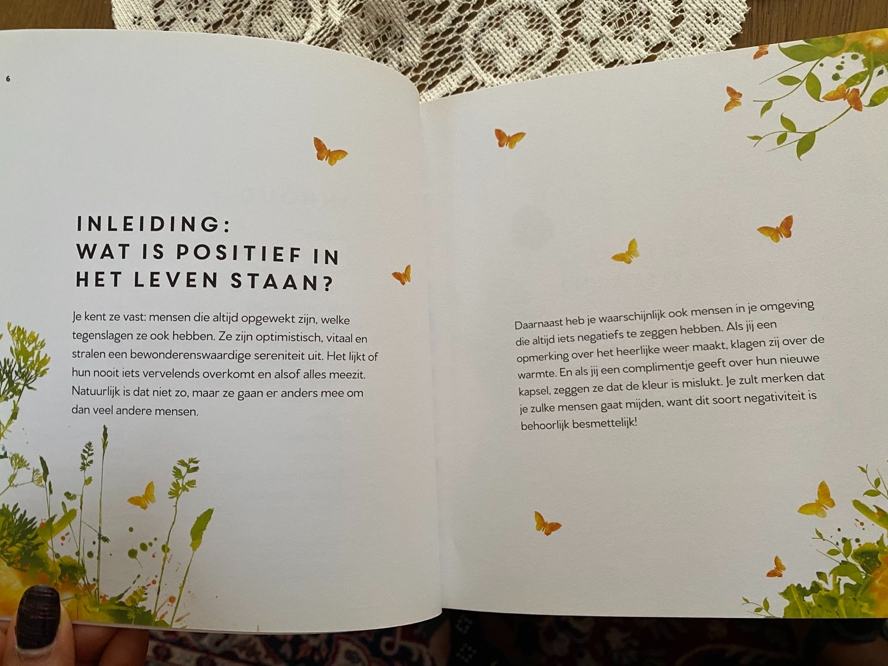

# De Kracht van Positief Denken

2 t/m 10

## Inleiding:

### Wat is positief in het leven staan?

Je kent ze vast, mensen die altijd opgewekt zijn, welke tegenslagen ze ook hebben. Ze zijn optimistisch, vitaal en
stralen een bewonderenswaardige sereniteit uit. Het lijkt of hun nooit iets vervelendfs overkomt en alsof alles meezit.
Natuurlijk is dat niet zo, maar ze gaan er anders mee om dan veel andere mensen.

Daarnaast heb je waarschijnlijk ook mensen in je omgeving die altijd iets negatiefs te zeggen hebben. Als jij een
opmerking over het heerlijke weer maakt klagen zij over de warmte. en als jij een complimentje geeft over hun nieuwe
kapsel, zeggen ze dat de kleur is mislukt. Je zult merken dat je zulke mensen gaat mijden, want dit soort negativiteit
is behoorlijk besmettelijk.

